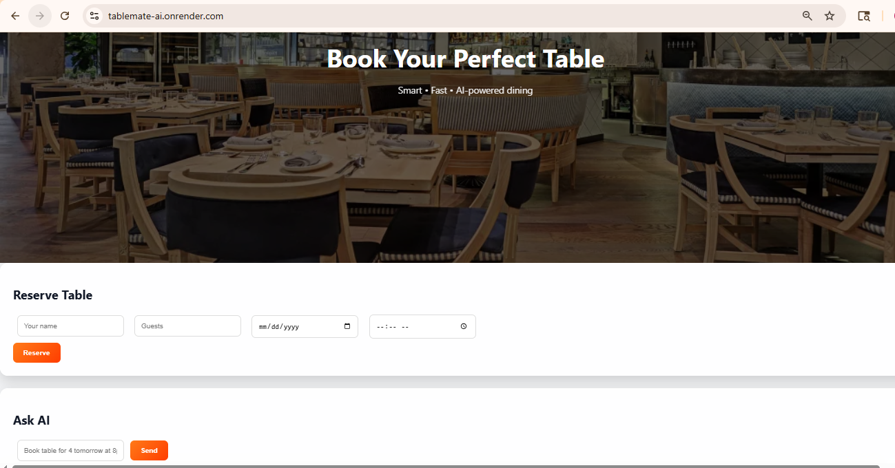
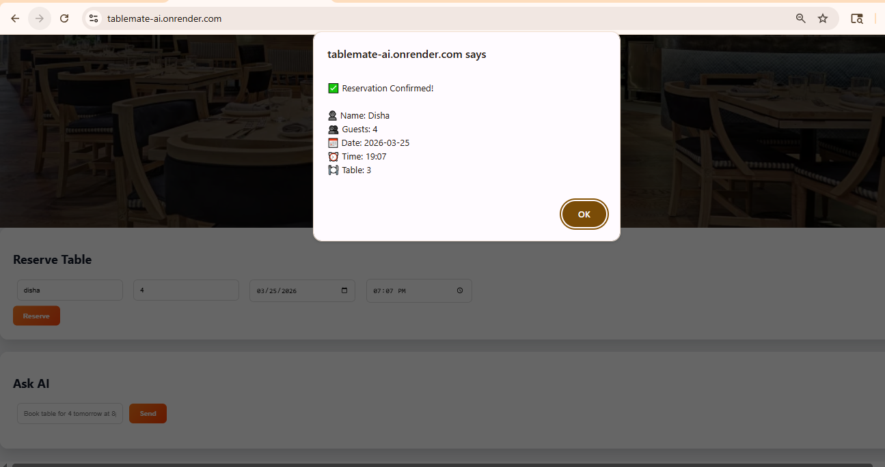
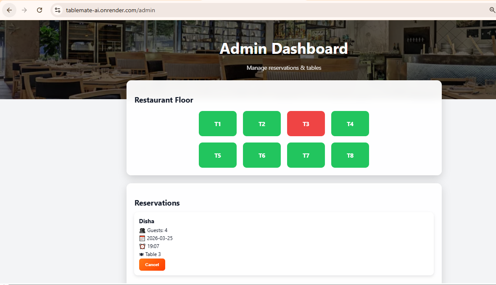

#  TableMate AI

TableMate AI is a simple AI-powered restaurant booking app.

Instead of filling long forms, users can just type something like:

> “Book a table for 4 tomorrow at 8pm”

and the system takes care of the rest.

I built this project to explore how AI can be used in real-world applications like reservations and booking systems.

---

##  Live Demo

https://tablemate-ai.onrender.com

---

##  Screenshots

### Home Page


### Booking Confirmation


### Admin Dashboard


---

##  What it can do

- Book tables using natural language  
- Store and manage reservations  
- Show bookings in an admin dashboard  
- Cancel reservations  
- Basic admin authentication  

---

##  Tech Stack

- FastAPI (backend)  
- Groq API (LLM integration)  
- SQLite (database)  
- HTML, CSS, JavaScript (frontend)  
- Render (deployment)  

---

##  Security

- Admin access is protected  
- API keys are stored using environment variables  
- No sensitive data is hardcoded  

---

##  Running Locally

Clone the repo:

```bash
git clone https://github.com/dishapatil1111/tablemate-ai.git
cd tablemate-ai

Install dependencies:
pip install -r requirements.txt

Create a .env file:
GROQ_API_KEY=your_api_key
ADMIN_USER=admin
ADMIN_PASS=admin123

Run the app:
python app.py


📈 Future Improvements

Add proper user authentication
Improve mobile UI
Add memory to AI conversations
Add booking analytics
Switch to PostgreSQL for production


👩‍💻 Author

Disha Patil